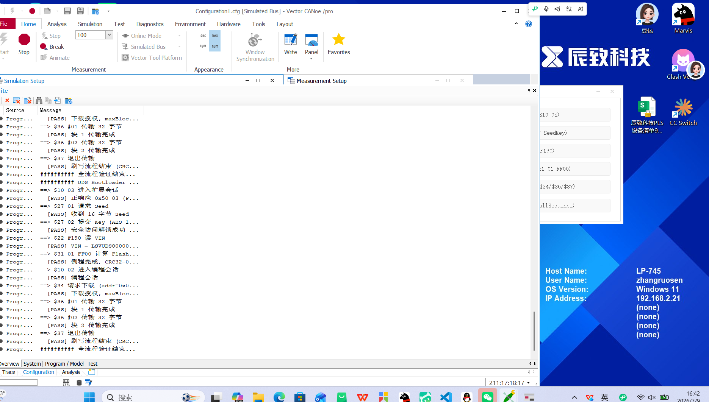
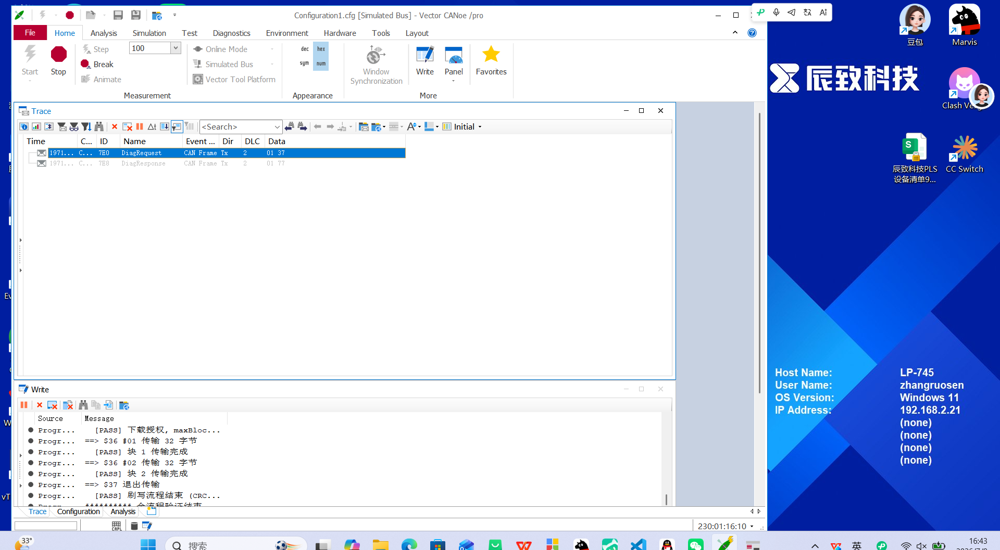
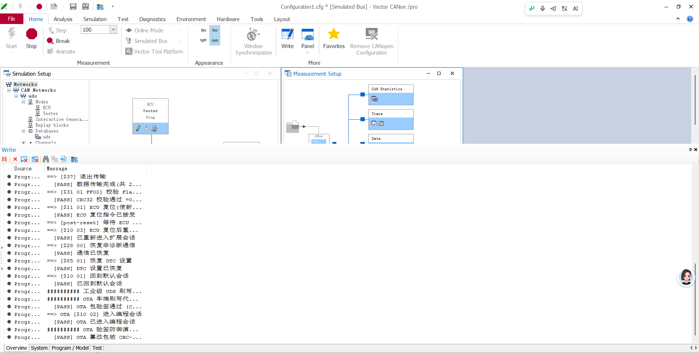

# CANoe 验证记录

| 项目 | 内容 |
|------|------|
| 验证时间 | 2026-07-09 |
| CANoe 版本 | Vector CANoe /pro |
| 运行模式 | Simulated Bus (as fast as possible) |
| 被测节点 | ECU 仿真节点（`uds_ecu.can`） |
| 测试节点 | Tester 诊断仪节点（`uds_tester.can`） |
| 总线通道 | CAN 1（uds 网络） |
| 诊断 ID | 请求 0x7E0 / 响应 0x7E8 |

## 验证目标

验证自研 UDS Bootloader C 协议栈在 CANoe 仿真环境下的端到端行为，已升级为**工业级预编程序列（量产刷写 13 步）**：
$10 03 扩展会话 → $85 02 关 DTC → $28 03 关非诊断通信 → $27 安全解锁 → $31 FF01 预编程检查 → $10 02 编程会话 → $34/$36/$37 下载刷写 → $31 FF00 CRC 校验 → $11 01 复位 → **$10 03 重新进入扩展会话** → $28 00/$85 01 恢复 → $10 01 回默认会话。

## 测试用例与结果

| 步骤 | UDS 服务 | 操作 | 预期结果 | 实际结果 |
|------|----------|------|----------|----------|
| 1 | $10 03 | 进入扩展会话 | 正响应 $50 03 | [PASS] |
| 2 | $85 02 | 关闭 DTC 设置（抑制故障码记录）| 正响应 $C5 02 | [PASS] |
| 3 | $28 03 | 关闭非诊断通信（Rx/Tx 应用报文）| 正响应 $68 03 | [PASS] |
| 4 | $27 01/02 | 请求 Seed / 回 Key（AES-128 派生）解锁 | 安全访问解锁成功 | [PASS] |
| 5 | $31 01 FF01 | 检查预编程条件（电压/故障/安全）| 条件满足 $71..00 | [PASS] |
| 6 | $10 02 | 进入编程会话 | 正响应 $50 02 | [PASS] |
| 7 | $34 / $36×2 / $37 | 请求下载 → 2 块连续帧传输 → 退出传输 | 块 1、块 2 全部完成 | [PASS] 块 1 / 块 2 |
| 8 | $31 01 FF00 | 校验 Flash CRC32（完整性）| 返回 CRC32 值 | [PASS] |
| 9 | $11 01 | ECU 复位（使新固件生效）| 正响应 $51 01 | [PASS] |
| 10 | $10 03 | ECU 复位后重新进入扩展会话 | 正响应 $50 03 | [PASS] |
| 11 | $28 00 | 恢复非诊断通信 | 正响应 $68 00 | [PASS] |
| 12 | $85 01 | 恢复 DTC 设置 | 正响应 $C5 01 | [PASS] |
| 13 | $10 01 | 回到默认会话 | 正响应 $50 01 | [PASS] |

## 关键现象

- 一键全流程（`DoFullSequence()` / 键盘 `r` / 面板按钮）现已升级为**工业级 13 步预编程序列**，Write 窗口逐条输出 `[PASS]`，直至 `########## 工业级 UDS 刷写全流程验证结束 (13 步全 PASS) ##########`。
- **关键修复**：$11 01 ECU 复位后，ECU 回到默认会话并安全等级归零； Tester 需要等待约 200ms 后重新发送 $10 03 进入扩展会话，再执行 $28 00/$85 01 恢复和 $10 01 回默认会话，否则服务因会话不支持返回 0x7F。
- 面板按钮需 **Panel Designer → File → Attach to Node → 选 Tester 节点** 才绑定生效；未绑定时按键盘 `r` 等价触发。
- Trace 窗口可见 `DiagRequest` / `DiagResponse` 报文交互，底层 ID 为 0x7E0 / 0x7E8（CANoe 通过 `uds.dbc` 解析为诊断名称显示）。

## 截图证据

### 1. Write 窗口 — 全 PASS 输出

### 2. Trace 窗口 — CAN 诊断报文交互

## 结论

基于 CANoe 的 UDS Bootloader 仿真验证已升级为**工业级预编程序列（13 步）**并全部通过，覆盖 ISO 14229-1 量产刷写核心服务与 ISO-TP 传输层行为。C 协议栈同步新增 $85/$28/$31 FF01 三项服务，单元测试由 38 项扩展至 **41 项全 PASS**。可作为简历项目作品集的核心验证证据。

---

# OTA 车端刷写验证（新增）

| 项目 | 内容 |
|------|------|
| 验证时间 | 2026-07-10 |
| CANoe 版本 | Vector CANoe /pro |
| 运行模式 | Simulated Bus (as fast as possible) |
| 被测节点 | ECU 仿真节点（`uds_ecu.can`） |
| 测试节点 | Tester 诊断仪节点（`uds_tester.can`，OTA 状态机） |
| 总线通道 | CAN 1（uds 网络） |
| 诊断 ID | 请求 0x7E0 / 响应 0x7E8 |

## 验证目标

在已验证的 UDS Bootloader 基础上，叠加**轻量车端 OTA 刷写代理**：
- 诊断仪端构造带 CBC-MAC 签名的升级包；
- 通过 `o` 键触发合法包：验签 → 进入编程会话 → 复用 $34/$36/$37 刷写引擎；
- 通过 `t` 键触发篡改包：验证 CBC-MAC 拦截，不刷写。

## 测试用例与结果

| 步骤 | 操作 | 预期结果 | 实际结果 |
|------|------|----------|----------|
| 1 | 一键全流程（键盘 `r`）| 13 步工业级预编程序列全 PASS | [PASS] |
| 2 | OTA 合法包刷写（键盘 `o`）| 验签通过 → 进入编程会话 → 刷写成功 | [PASS] |
| 3 | OTA 篡改包防护（键盘 `t`）| 篡改包 CBC-MAC 验签失败，不触发刷写 | [PASS] |

## 关键现象

- Write 窗口可见 `########## OTA 车端刷写代理 ##########` 标题；
- 合法包流程：`OTA 包验签通过` → `OTA 已进入编程会话` → 后续 $34/$36/$37 正常完成；
- 篡改包流程：`OTA 篡改包被 CBC-MAC 拦截` / `OTA 验签防误演示...`，Flash 不被改写；
- OTA 模块复用现有 AES-128 派生与 UDS 刷写引擎，无需重写 Bootloader 核心。

## 截图证据

### OTA 验证 — Write 窗口全 PASS

## 结论

基于 CANoe 的 OTA 车端刷写代理验证通过：合法包可安全落地刷写，篡改包被 CBC-MAC 拦截，满足量产 OTA 对**验签+防回滚+复用 Bootloader**的基本要求。C 协议栈单元测试同步扩展为 **49 项 / 220 断言 ALL PASS**。
